# Agent Society

> 自组织多智能体协作框架

Agent Society 是一个基于大语言模型的智能体协作系统。不同于传统的固定工作流，Agent Society 中的智能体可以像人类一样自主建立组织、分配任务、协作完成复杂目标。
---

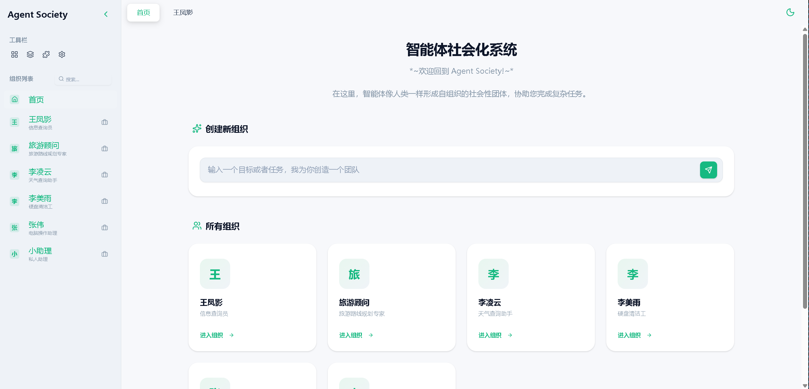

## 核心特性

- **自组织** - 智能体自主创建岗位、分配任务、建立协作关系，无需预置组织结构
- **多模型支持** - 同时连接多个 LLM 服务，根据任务智能选择最合适的模型
- **异步协作** - 智能体通过消息通信，支持并行处理与复杂协作模式
- **Web 界面** - 内置仿微信风格的可视化界面，实时查看对话和组织结构
- **模块化扩展** - 动态加载外部模块，扩展工具能力和 Web 组件

---

Agent Society 的记忆这块做了很多层:
- 核心目标，智能体是可以修改自己的提示词的。把非常重要的内容直接注入到自己的提示词里。
- 长期零碎的不重要的记忆，是先用0.2B小模型提取摘要，然后放在向量数据库里。
- 经历的重要事件摘要和需要记忆的技能，是通过大模型做摘要，放在层级管理的文件夹里。
- 跨智能体的团队共识要写成文档，放在工作区里。
- 一个岗位的工作内容是放在这个岗位的提示词里。同岗位的智能体都会共享这一段提示词。
- 智能体还可以自发的在工作区里写工作日志。
- 智能体之间传递消息量比较大的时候，都会在工作区里写报告，传文件名。
- 还有技能，是允许智能体自己创建技能的。
- 整个组织，也有个提示词，铆钉了整个组织存在的意义和工作的目标，就像企业的愿景。

这是七层记忆、 基于异步消息和文档、技能固化 的协作模式。

还允许智能体修改软件本身。直接把一项能力变成代码。并且这个代码能修改这个软件自己。这是一个完全AI驱动的形态不可知的一个软件。
这目前现在AI的这些软件，什么豆X啊、什么千X啊，这些，不管是网页上还是手机上还是PC的可执行文件，它本质上还是把AI当做数据库这种东西在用，都是一个查询语句得到一个结果。即使是claude这种编程软件，也是一问一答的处理AI的回复，也没有真正的把AI融到软件逻辑本身。几乎所有的软件都是这种模式，跟40年前用数据库是一样的模式。

Agent Society 允许智能体操作软件本身，直接把能力注入到软件里：智能体有能力修改软件的界面、创造新的功能。不仅Agent是可以自我进化的，软件也是根据用户的需要自我进化的。


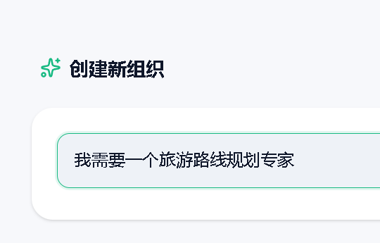
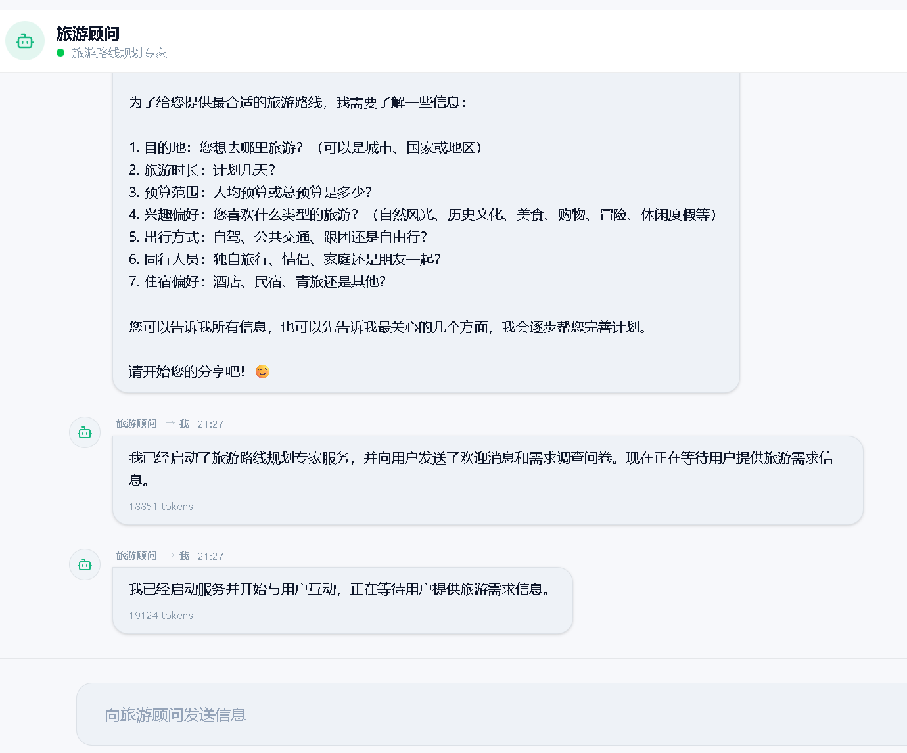

### 记事本操作

点击查看视频：

[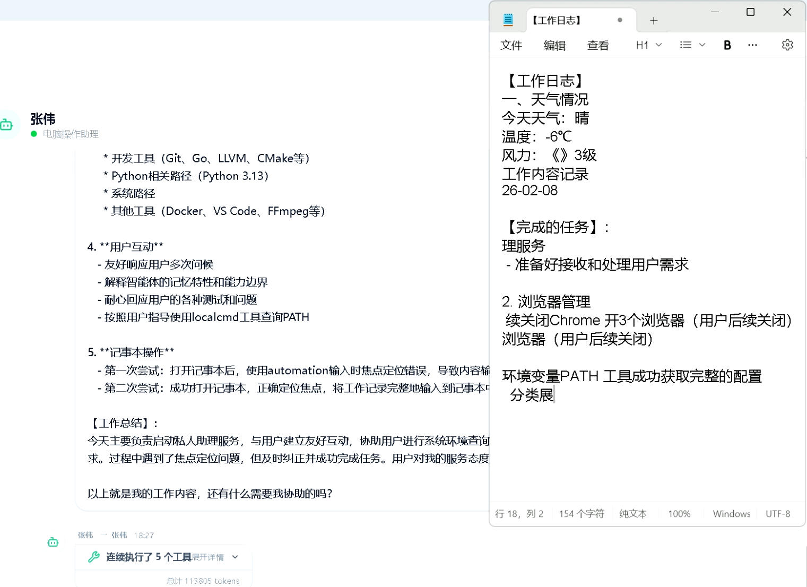](docs/video/记事本操作.mp4)

### 软件研发团队

点击查看视频：

[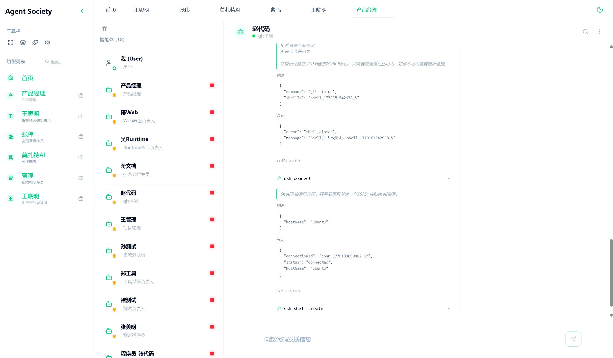](docs/video/软件团队.mp4)

### 浏览器开发者工具调用

点击查看视频：


[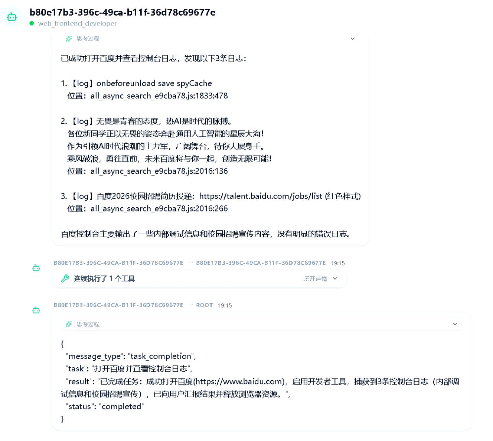](docs/video/获取网页控制台.mp4)

### 视频生成和剪辑

点击查看视频：

[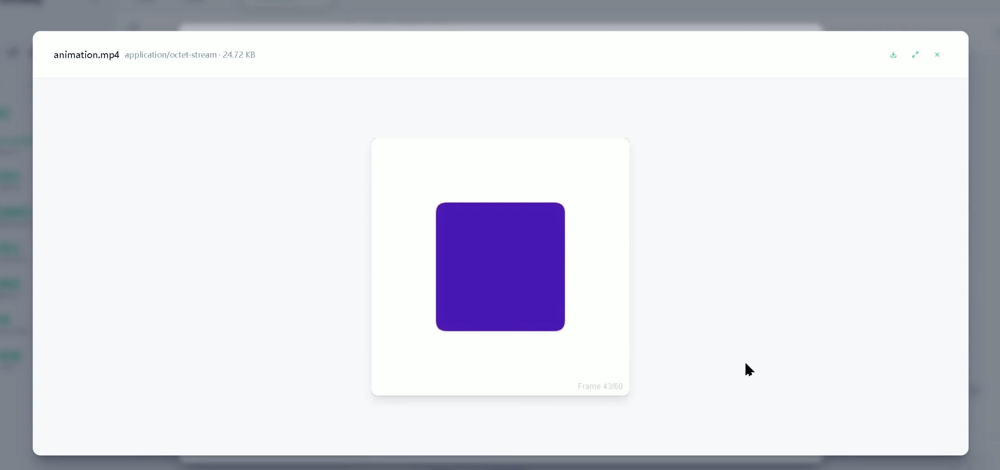](docs/video/视频生成和剪辑.mp4)


### 即时生成UI

点击查看视频：

[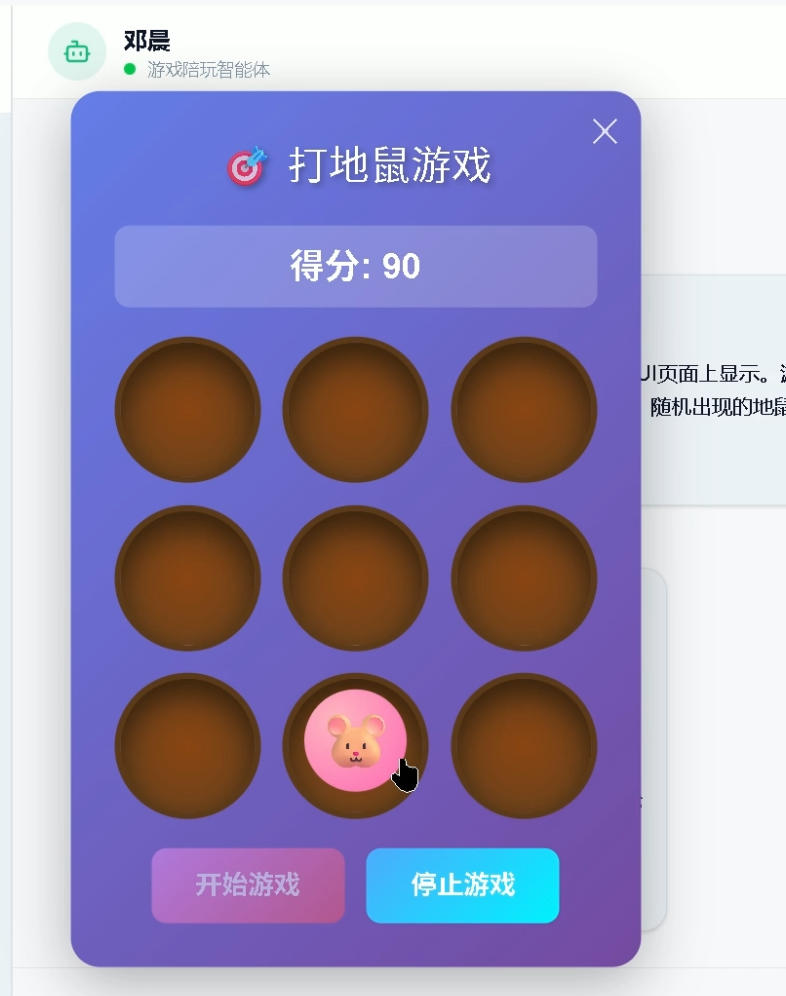](docs/video/打地鼠.mp4)


### 天气挂件即时生成


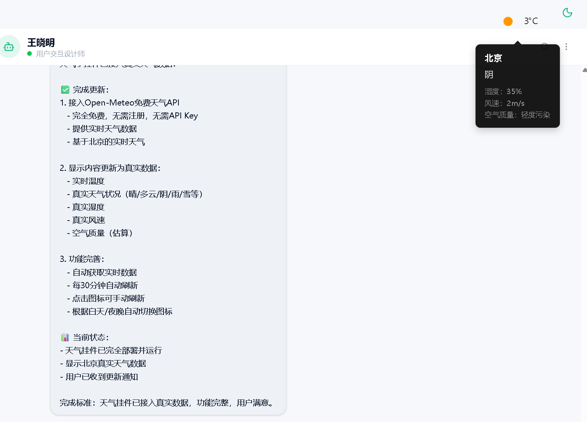

### 组织架构

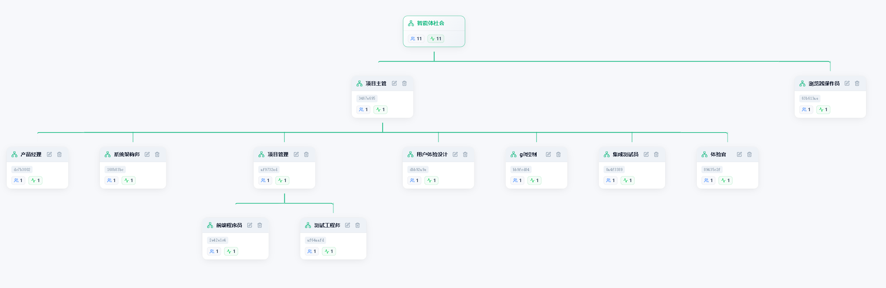


---

### 更多样例

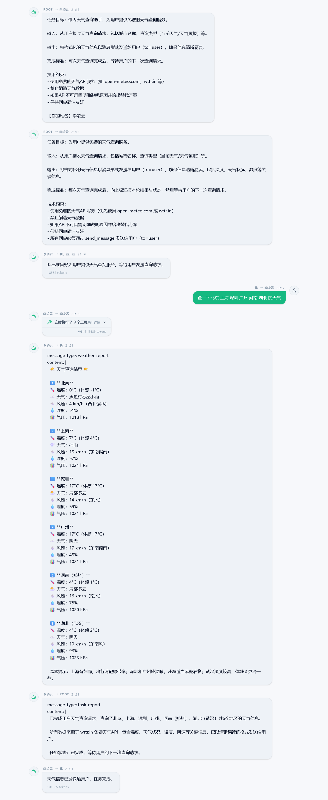

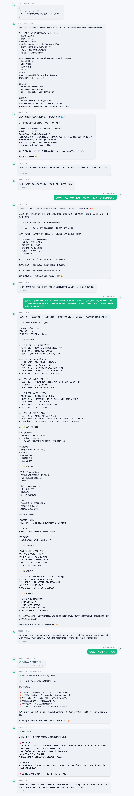

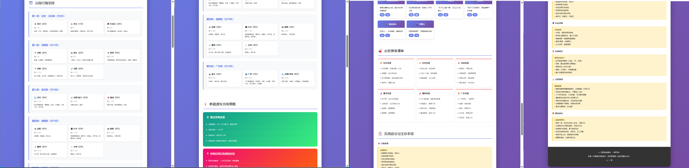

## 快速开始

### 环境要求

- Node.js >= 18（推荐）。项目内置 [Bun](https://bun.sh/) 作为备选运行时，无需 Node.js 时自动启用
- 兼容 OpenAI API 的 LLM 服务

### 安装

```bash
git clone https://gitee.com/duzc2/agent_society.git
cd agent_society
npm install
```


### 启动

```bash
npm start
```

启动后会自动打开浏览器访问 Web 界面（`http://localhost:3000`）。

---


## 使用方式

启动系统后，直接在浏览器里像微信一样与智能体对话：

1. 向 Root 智能体提出需求
2. 观察智能体自主拆解任务、创建子智能体
3. 实时查看智能体之间的协作过程
4. 随时介入对话，与智能体互动

---

## 系统工作方式

```
用户
 │
 ▼
Root 智能体 —— 分析需求，拆解任务
 │
 ├──────┬──────┐
 ▼      ▼      ▼
智能体A  智能体B  智能体C
 │        │
 ▼        ▼
智能体D  智能体E
```

1. **用户**向 Root 智能体提出需求
2. **Root**分析需求，决定是否需要创建子智能体
3. **子智能体**独立执行任务，必要时继续创建下级智能体
4. **结果汇总**后返回给用户

每个智能体只掌握完成任务所需的最小上下文，复杂任务通过工作区和消息传递协作完成。

---

## 配置

第一次登录网页后会弹出设置界面，如果需要手动设置，需要编辑配置文件。手动修改配置文件后需要重新启动服务器才能加载。

1. 复制配置文件模板：

```bash
cp config/app.json config/app.local.json
cp config/llmservices.json config/llmservices.local.json
```

2. 编辑 `config/app.local.json`，配置你的 LLM 服务：

```json
{
  "llm": {
    "baseURL": "http://127.0.0.1:1234/v1",
    "model": "your-model-name",
    "apiKey": "your-api-key"
  }
}
```
---
### 配置多模型服务

可以为不同岗位配置不同的 LLM 服务：

```json
{
  "services": [
    {
      "id": "gpt4",
      "name": "GPT-4",
      "baseURL": "https://api.openai.com/v1",
      "model": "gpt-4",
      "apiKey": "sk-...",
      "capabilityTags": ["reasoning", "coding"]
    },
    {
      "id": "local",
      "name": "本地模型",
      "baseURL": "http://localhost:1234/v1",
      "model": "qwen2.5-7b",
      "apiKey": "any",
      "capabilityTags": ["chat", "fast"]
    }
  ]
}
```

系统会根据岗位提示词自动选择最合适的模型，也可以手动指定。

---

### 扩展模块

通过模块扩展系统能力：

- **chrome** - 控制 Chrome 浏览器，实现网页自动化
- **ssh** - SSH 远程连接，操作远程服务器

在 `config/app.local.json` 中启用：

```json
{
  "modules": {
    "chrome": { "headless": false },
    "ssh": { "enabled": true }
  }
}
```

---

## 文档

- [快速入门指南](./docs/getting-started.md) - 详细安装配置说明
- [配置指南](./docs/configuration.md) - 配置项详解
- [工具参考](./docs/tools.md) - 可用工具列表
- [开发者参考](./DEV.md) - 开发者参考
---

## 开源协议

本项目采用 [Apache License 2.0](./LICENSE) 开源协议。

```
Copyright 2025 Agent Society Contributors

Licensed under the Apache License, Version 2.0 (the "License");
you may not use this file except in compliance with the License.
You may obtain a copy of the License at

    http://www.apache.org/licenses/LICENSE-2.0

Unless required by applicable law or agreed to in writing, software
distributed under the License is distributed on an "AS IS" BASIS,
WITHOUT WARRANTIES OR CONDITIONS OF ANY KIND, either express or implied.
See the License for the specific language governing permissions and
limitations under the License.
```

---

<p align="center">
  <a href="https://gitee.com/duzc2/agent_society">Gitee</a> •
  <a href="./docs/getting-started.md">文档</a> •
  <a href="./LICENSE">许可证</a>
</p>
